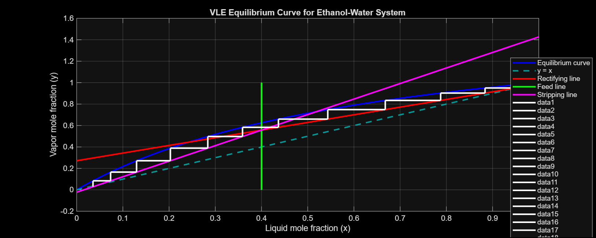
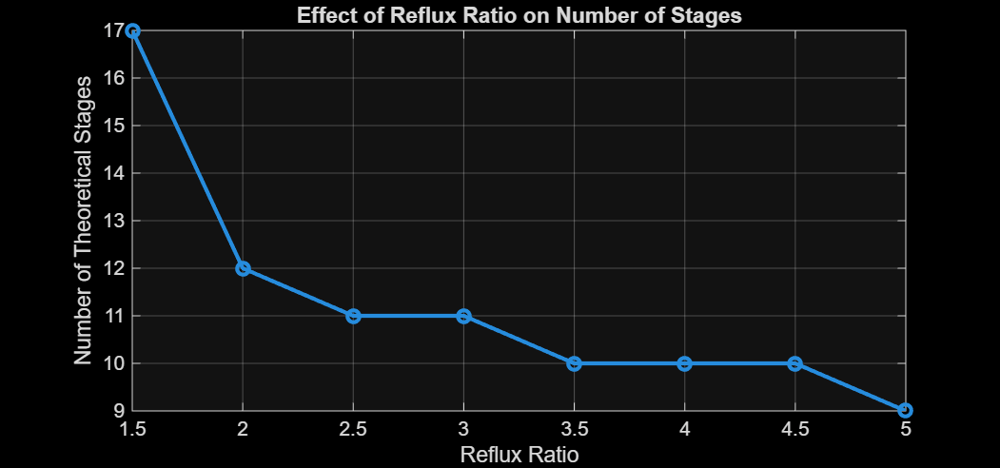

# Binary Distillation Column Design & Simulation

This project implements the **McCabe–Thiele method in MATLAB** to study binary distillation of an ethanol–water mixture and estimate the number of theoretical stages required for separation.

## Overview

The simulation models vapor–liquid equilibrium and the operating lines of a distillation column to perform tray-by-tray stage stepping using the McCabe–Thiele graphical method. Starting from the distillate composition, the algorithm alternates between the equilibrium curve and the operating lines until the bottom composition is reached, allowing the number of theoretical stages to be determined.

## What the Model Includes

- Vapor–Liquid Equilibrium (VLE) modeling using relative volatility  
- Rectifying and stripping operating line calculations  
- Feed condition representation using the **q-line**  
- Automated McCabe–Thiele stage stepping in MATLAB  
- Estimation of theoretical stages for a given reflux ratio  
- A small sensitivity study showing how reflux ratio affects stage requirements  

## Results

### McCabe–Thiele Diagram

### Effect of Reflux Ratio on Number of Stages

## Key Insight

The simulation highlights the classic trade-off in distillation design:

- **Higher reflux ratio → fewer stages required**
- **Lower reflux ratio → more stages required**

This is one of the central design considerations when balancing **column height and energy consumption** in industrial distillation systems.

## Tools Used

MATLAB • Separation Processes • Heat & Material Balance

## Author

Rohit Guleria  
B.Tech Chemical Engineering  
IIT (ISM) Dhanbad